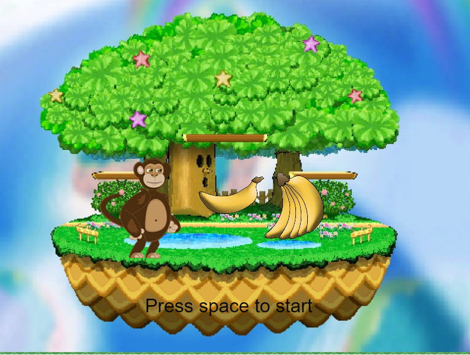
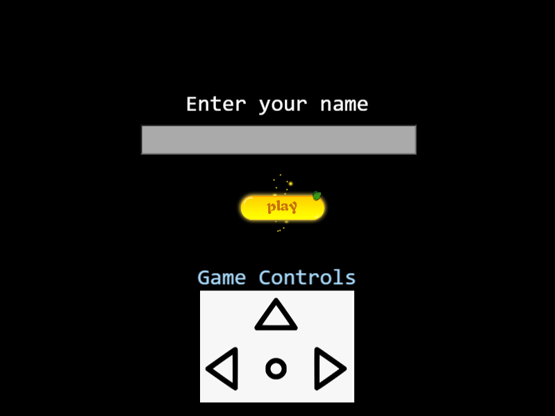
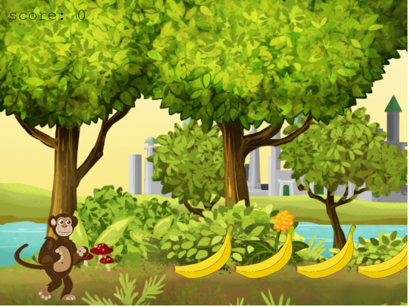

# RPG-GAME

> This video game is based on the concept that a player will help monkey to eat bananas in the forest by escaping from the Wild Cats.

## Table of Contents

- [Concept](#Concept)
- [Game Scenes](#game-scenes)
- [How to Play](#how-to-play)
- [Built With](#built-with)
- [Live Demo](#live-demo)
- [Getting Started](#getting-started)
  - [Installation](#installation)
  - [Usage](#usage)
- [Author](#author)

## Concept

- A monkey is looking for the bananas in a forest. But the Wild Cats are all over roaming around the forest. The player will get bananas for a monkey by helping to escape from the Wild Cats.


## Game Scenes

### Welcome Scene



### Title Scene



### Game Scene




## How To Play

- The monkey can be controlled with arrow keys(UP, LEFT, RIGHT).
  - Left  -   For moving towards Left Direction
  - Right -   For moving towards Right Direction
  - Up    -   For Jumping

## Built With

- [HTML](https://developer.mozilla.org/en-US/docs/Web/html)
- [Javascript](https://developer.mozilla.org/en-US/docs/Web/javascript)
- [CSS](https://developer.mozilla.org/en-US/docs/Web/CSS)
- [Phaser 3](https://www.phaser.io/phaser3)
- [Webpack](https://webpack.js.org/)
- [Babel](https://babeljs.io/)
- [Jest](https://jestjs.io/)
- [Netlify](https://netlify.com/)

## Live Demo

[Live Demo Link](https://sleepy-bardeen-ee67a3.netlify.app/)

## Getting Started

To get a local copy up and running, follow these simple example steps.


### Installation

Clone the repo with:

```sh
git clone https://github.com/hemant-soni-vst-au4/RPG-Game
```

### Usage

1. Run `npm install` to install all dependencies

2. Run `npm run start` to start the local server

### Testing

Run `npm test` to test the application using JEST


## Author

👤 **Hemant soni**

- Github: [@githubhandle](https://github.com/hemant-soni-vst-au4)
- Twitter: [@twitterhandle](https://twitter.com/abdelperez11)
- Linkedin: [linkedin](https://www.linkedin.com/in/hemant-soni-97427b193/)

## 🤝 Contributing

Contributions, issues and feature requests are welcome!

Feel free to check the [issues page](https://github.com/hemant-soni-vst-au4/RPG-Game/issues/).

## Show your support

Give a ⭐️ if you like this project!

## Acknowledgments

- Thanks to [Microverse](www.microverse.org) for the opportunity.
- Thanks to [The Odin Project](https://www.theodinproject.com/) for the guidance.